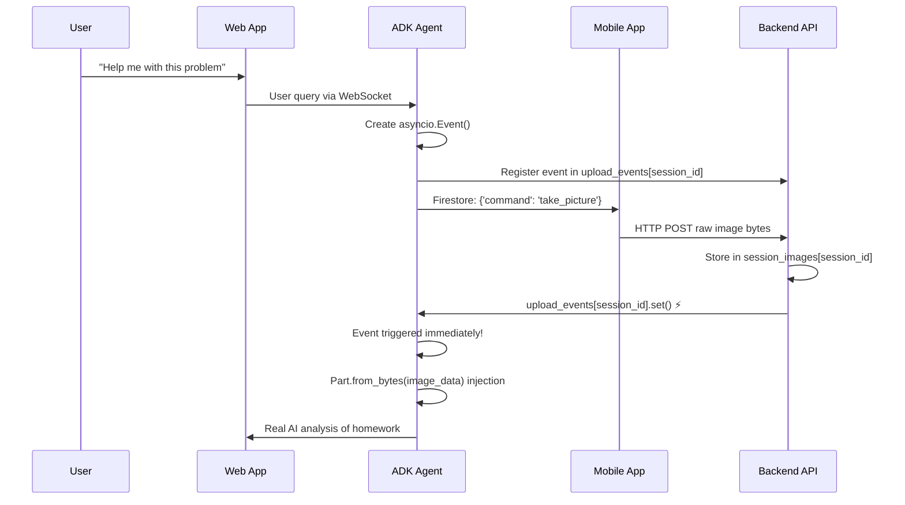

# HW Buddy Live Backend

This is the updated backend implementation using Google's ADK (Agent Development Kit) for intelligent homework tutoring with real-time audio streaming and optimized image processing.

## 🎯 Current Architecture

### Key Features:
- **ADK Agent with Tool Calling**: Intelligent homework tutoring agent that decides when to take pictures
- **Real-time Audio Streaming**: Direct WebSocket audio communication via ADK Live API
- **Event-based Image Processing**: Immediate image processing with `Part.from_bytes()` injection
- **Direct Mobile Upload**: Mobile app uploads images directly to backend for <50ms processing
- **WebSocket Real-time Updates**: Live status updates to frontend during image processing
- **Session Management**: Robust session handling with duplicate connection prevention

### Components:

#### 1. `main.py` - Primary Server
- FastAPI server with WebSocket support for real-time communication
- **NEW**: Event-based image upload notification (`upload_events = {}`)
- Session management and global storage (`session_images = {}`)
- Direct HTTP image upload endpoint: `POST /sessions/{session_id}/upload_image`

#### 2. `hw_tutor_agent.py` - ADK Agent
- **ADK Agent**: Uses Google ADK framework with intelligent tool calling
- **Take Picture Tool**: `take_picture_and_analyze_tool()` triggers mobile image capture
- **Event-based Waiting**: Replaced Firestore listener with `asyncio.Event` for 10-20x faster response
- **Image Injection**: Uses `Part.from_bytes()` to inject raw image data directly into LLM context
- **Smart Decision Making**: Agent only takes pictures when contextually relevant

#### 3. `firestore_listener.py` - Legacy (Partially Used)
- **DEPRECATED**: No longer used for image upload coordination
- Still used for mobile app Firestore command coordination
- Will be fully removed in future versions

#### 4. Mobile App Integration
- **Direct Upload**: Raw image bytes uploaded via HTTP POST (no user_ask field)
- **Firestore Commands**: Still listens to Firestore for `{'command': 'take_picture'}`
- **Optimized Flow**: Capture → Compress → Upload → Immediate processing

## 🚀 Quick Start

**Note**: Different Live models are availabe depending on if you are using AI Studio vs. Vertex!
- [Vertex AI](https://cloud.google.com/vertex-ai/generative-ai/docs/live-api)
- [AI Studio](https://ai.google.dev/gemini-api/docs/live)

### 1. Backend Setup
```bash
cd backend
uv sync
source .venv/bin/activate  # On Windows: .venv\Scripts\activate
```

### 2. Configure Environment
```bash
# Set up Google AI API key
export GOOGLE_AI_API_KEY="your-gemini-api-key"

# Set up Firebase credentials (for mobile app coordination)
export GOOGLE_APPLICATION_CREDENTIALS="path/to/firebase-service-account.json"
```

### 3. Start the Backend Server
```bash
python main_live.py
```

Or with uvicorn:
**Note** Only this option works with ngrok
```bash
uvicorn main:app --reload --host 0.0.0.0 --port 8000
```

### 4. Frontend Setup
```bash
cd ../web-app
npm install
npm run dev
```

### 5. Mobile App Setup
```bash
cd ../mobile-app
./run_mobile_app.sh
```

## 📡 API Endpoints

### WebSocket Communication
```http
WebSocket: ws://localhost:8000/ws/{session_id}
```

Real-time communication for:
- Audio streaming
- Status updates during image processing
- ADK agent responses

### Image Upload (Mobile App)
```http
POST /sessions/{session_id}/upload_image
Content-Type: multipart/form-data

file: <image_file>
```

**NEW**: No longer requires `user_ask` field - mobile app only sends raw image data.

### Legacy Endpoints
```http
POST /take_picture  # For backward compatibility
GET /health         # Health check
```

## 🎯 Image Processing Flow (Current)

### Event-Based Architecture (10-20x Faster):



### Performance Comparison:

| Metric | Before (Firestore) | After (Events) | Improvement |
|--------|-------------------|---------------|-------------|
| **Latency** | ~500-1000ms | ~10-50ms | **10-20x faster** |
| **Reliability** | Network dependent | In-process | **Much more reliable** |
| **Code Complexity** | High (async listener) | Low (simple event) | **Significantly simpler** |
| **Memory Usage** | Firestore connections | Simple dict storage | **Lower overhead** |

## 🎵 Audio Streaming Protocol

### WebSocket Messages:

#### Client → Server:
```json
{
  "type": "process_query",
  "user_ask": "Can you help me solve this math problem?"
}

{
  "type": "ping",
  "data": {}
}
```

#### Server → Client:
```json
{
  "type": "status_update",
  "status": "processing_started",
  "data": {"message": "Starting to process your question..."}
}

{
  "type": "adk_event", 
  "event_type": "tool_call",
  "data": {"tool": "take_picture_and_analyze", "message": "Taking picture..."}
}

{
  "type": "final_response",
  "data": {
    "success": true,
    "image_url": "session:abc123",
    "mathjax_content": "$$x = \\frac{-b \\pm \\sqrt{b^2-4ac}}{2a}$$",
    "help_text": "I can see your quadratic equation..."
  }
}
```

### Connection Management:
- **One Connection Per Session**: Each session ID maintains single WebSocket connection
- **Duplicate Prevention**: Automatic rejection of duplicate connections
- **Task Management**: Cancels previous queries when new ones arrive

## 📱 Mobile App Integration

### Current Implementation:
```dart
// Mobile app uploads raw image only
final uri = Uri.parse('$BACKEND_URL/sessions/$sessionId/upload_image');
final request = http.MultipartRequest('POST', uri);

request.files.add(
  await http.MultipartFile.fromPath(
    'file',
    compressedImage.path,
    contentType: MediaType('image', 'jpeg'),
  ),
);
// No user_ask field - just raw image data

final response = await request.send();
```

### Features:
- **Pre-initialized Camera**: Fast image capture using `CameraService`
- **Automatic Compression**: Reduces file size for faster upload
- **Direct HTTP Upload**: No cloud storage overhead
- **Real-time Status**: Live feedback during processing

## 🔧 ADK Agent Configuration

### Tool Definition:
```python
async def take_picture_and_analyze_tool(tool_context: ToolContext, user_ask: str) -> str:
    # 1. Create event for direct notification
    upload_event = asyncio.Event()
    upload_events[session_id] = upload_event
    
    # 2. Trigger mobile app
    session_ref.update({'command': 'take_picture'})
    
    # 3. Wait for immediate notification (not Firestore!)
    await upload_event.wait()
    
    # 4. Get raw image bytes from session storage
    image_bytes = session_images[session_id]['bytes']
    mime_type = session_images[session_id]['mime_type']
    
    # 5. Store for injection callback
    tool_context.state["pending_image_bytes"] = image_bytes
    tool_context.state["pending_image_mime_type"] = mime_type
    
    return "Image captured successfully. I can now see your homework."
```

### Image Injection:
```python
def inject_image_callback(callback_context: CallbackContext, llm_request: LlmRequest):
    pending_image_bytes = callback_context.state.get("pending_image_bytes")
    pending_mime_type = callback_context.state.get("pending_image_mime_type")
    
    if pending_image_bytes:
        # Direct injection using raw bytes - much faster than URI!
        image_part = Part.from_bytes(
            data=pending_image_bytes,
            mime_type=pending_mime_type
        )
        
        image_content = Content(role="user", parts=[image_part])
        llm_request.contents.append(image_content)
```

## 🔍 Debugging & Monitoring

### Key Log Messages:
```
INFO - WebSocket connected for session session_abc123
INFO - Taking picture for session session_abc123
INFO - Stored image for session session_abc123: 245760 bytes
INFO - Notified ADK agent that image is ready for session session_abc123
INFO - Retrieved image data: 245760 bytes, type: image/jpeg
INFO - Injecting image bytes into LLM request: 245760 bytes
INFO - Image bytes successfully injected into LLM request
```

### Debug Endpoints:
```http
GET /health                    # Health check
GET /debug/sessions           # List active sessions
GET /debug/upload_events      # Check pending events
```

### Performance Monitoring:
```bash
# Monitor upload events and processing time
tail -f logs/app.log | grep -E "(Stored image|Notified ADK|Retrieved image)"

# Expected timing:
# Stored image: <10ms after upload
# Notified ADK: <5ms after storage  
# Retrieved image: <5ms after notification
# Total: <50ms end-to-end
```

## 🔄 Migration Notes

### What Changed:
1. **Firestore Listener**: Replaced with in-process `asyncio.Event` 
2. **Image Injection**: Now uses `Part.from_bytes()` instead of `Part.from_uri()`
3. **Mobile Upload**: Simplified to raw image data only
4. **Event Storage**: Added `upload_events = {}` global storage
5. **Error Handling**: Direct exception propagation vs. timeout errors

### What Stayed:
1. **Mobile App Firestore**: Still uses Firestore for command coordination
2. **Session Management**: Same session ID concepts
3. **WebSocket Protocol**: Same message structure for frontend
4. **ADK Agent Logic**: Same intelligent decision-making for when to take pictures

### Removed Dependencies:
- No longer imports `firestore_listener.py` in ADK agent
- No GCS (Google Cloud Storage) dependencies
- Simplified Firestore usage (commands only, not image coordination)

## ⚙️ Environment Configuration

### Required:
```bash
GOOGLE_AI_API_KEY=your-gemini-api-key                    # For ADK agent
GOOGLE_APPLICATION_CREDENTIALS=path/to/firebase-key.json # For Firestore commands
```

### Optional:
```bash
HOST=0.0.0.0
PORT=8000
LOG_LEVEL=INFO
```

## 🎯 Production Considerations

### Performance:
- **Memory Management**: Clean up `session_images` and `upload_events` on session end
- **Concurrent Sessions**: Test with multiple simultaneous image uploads
- **Event Cleanup**: Prevent memory leaks from abandoned events

### Security:
- **Image Validation**: Validate file types and size limits
- **Session Validation**: Implement proper session ID validation
- **Rate Limiting**: Add limits for image upload frequency

### Monitoring:
- **Event Metrics**: Track event creation, completion, and cleanup
- **Processing Time**: Monitor end-to-end image processing latency
- **Memory Usage**: Monitor growth of global storage dictionaries

## 🚀 Future Improvements

### Planned:
1. **Complete Firestore Removal**: Remove mobile app Firestore dependency
2. **Direct Mobile WebSocket**: Mobile app connects directly via WebSocket
3. **Session Persistence**: Optional database storage for session data
4. **Load Balancing**: Session affinity for multi-instance deployments

### Architecture Evolution:
```
Current:  Mobile → Firestore → Backend (events) → ADK Agent
Future:   Mobile → WebSocket → Backend → ADK Agent (full real-time)
```

This will eliminate the last Firestore dependency and create a fully real-time, event-driven architecture.