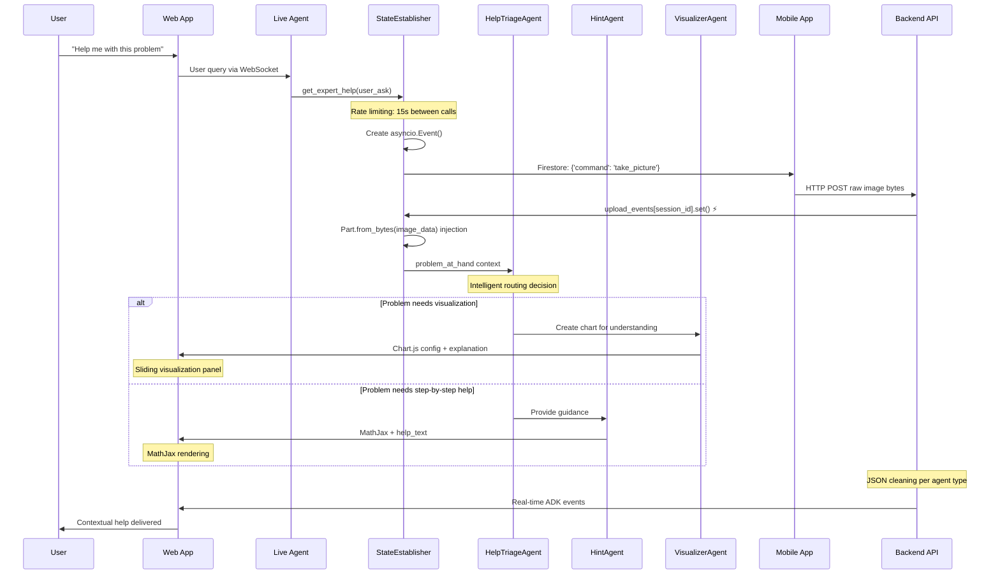

# HW Buddy Live Backend

This is the updated backend implementation using Google's ADK (Agent Development Kit) for intelligent homework tutoring with real-time audio streaming and optimized image processing.

## 🎯 Current Architecture

### Key Features:
- **Sequential Agent Architecture**: Multi-agent system with intelligent routing between HintAgent and VisualizerAgent
- **Real-time Audio Streaming**: Direct WebSocket audio communication via ADK Live API
- **Event-based Image Processing**: Immediate image processing with `Part.from_bytes()` injection
- **Direct Mobile Upload**: Mobile app uploads images directly to backend for <50ms processing
- **WebSocket Real-time Updates**: Live status updates to frontend during image processing
- **Interactive Visualizations**: Chart.js integration for mathematical visualizations
- **Session Management**: Robust session handling with duplicate connection prevention
- **Rate Limiting**: Prevents rapid-fire requests with intelligent callback filtering

### Components:

#### 1. `main_live.py` - Primary Server
- FastAPI server with WebSocket support for real-time communication
- Event-based image upload notification (`upload_events = {}`)
- Session management and global storage (`session_images = {}`)
- Direct HTTP image upload endpoint: `POST /sessions/{session_id}/upload_image`
- Audio WebSocket management via `audio_websocket_server.py`

#### 2. `hw_live_agent.py` - Sequential Agent System
- **Sequential Agent**: `StateEstablisherAgent` → `HelpTriageAgent` → `[HintAgent | VisualizerAgent]`
- **Take Picture Tool**: `take_picture_and_analyze_tool()` triggers mobile image capture
- **Event-based Waiting**: Uses `asyncio.Event` for 10-20x faster response than Firestore
- **Image Injection**: Uses `Part.from_bytes()` to inject raw image data directly into LLM context
- **Intelligent Routing**: HelpTriageAgent decides between hints and visualizations based on problem type
- **Rate Limiting**: Prevents rapid-fire requests with 15s expert help and 5s tool call limits

#### 3. `audio_websocket_server.py` - Real-time Communication
- WebSocket manager for bidirectional audio streaming
- ADK event forwarding with agent-specific JSON cleaning
- Real-time status updates during image processing
- Session management and connection lifecycle

#### 4. Agent Architecture Details
- **StateEstablisherAgent**: Takes pictures and establishes problem context
- **HelpTriageAgent**: Routes between hint and visualization based on problem analysis
- **HintAgent**: Provides step-by-step guidance and mathematical explanations
- **VisualizerAgent**: Creates Chart.js configurations for interactive visualizations
- **JSON Cleaning**: Separate cleaning functions for MathJax vs. visualization responses

#### 5. Mobile App Integration
- **Direct Upload**: Raw image bytes uploaded via HTTP POST
- **Firestore Commands**: Still listens to Firestore for `{'command': 'take_picture'}`
- **Optimized Flow**: Capture → Compress → Upload → Immediate processing

## 🚀 Quick Start

**Note**: Different Live models are availabe depending on if you are using AI Studio vs. Vertex!
- [Vertex AI](https://cloud.google.com/vertex-ai/generative-ai/docs/live-api)
- [AI Studio](https://ai.google.dev/gemini-api/docs/live)

### 1. Backend Setup
```bash
cd backend
uv sync
source .venv/bin/activate  # On Windows: .venv\Scripts\activate
```

### 2. Configure Environment
```bash
# Set up Google AI API key
export GOOGLE_AI_API_KEY="your-gemini-api-key"

# Set up Firebase credentials (for mobile app coordination)
export GOOGLE_APPLICATION_CREDENTIALS="path/to/firebase-service-account.json"
```

### 3. Start the Backend Server
```bash
python main_live.py
```

Or with uvicorn:
**Note** Only this option works with ngrok
```bash
uvicorn main:app --reload --host 0.0.0.0 --port 8000
```

### 4. Frontend Setup
```bash
cd ../web-app
npm install
npm run dev
```

### 5. Mobile App Setup

1. Change the Runner config file in Swift to your Team and Bundle identifier and then ensure it saves. 


2. Build and run the app using the utility script
```bash
cd ../mobile-app
./run_mobile_app.sh
```

## 📡 API Endpoints

### WebSocket Communication
```http
WebSocket: ws://localhost:8000/ws/{session_id}
```

Real-time communication for:
- Audio streaming
- Status updates during image processing
- ADK agent responses

### Image Upload (Mobile App)
```http
POST /sessions/{session_id}/upload_image
Content-Type: multipart/form-data

file: <image_file>
```

**NEW**: No longer requires `user_ask` field - mobile app only sends raw image data.

### Legacy Endpoints
```http
POST /take_picture  # For backward compatibility
GET /health         # Health check
```

## 🎯 Sequential Agent Flow (Current)

### Multi-Agent Architecture with Intelligent Routing:



## 🤖 Agent Architecture & State Management

### Sequential Agent Flow:
```
LiveAgent → get_expert_help() → SequentialAgent:
  1. StateEstablisherAgent (with take_picture_tool)
  2. HelpTriageAgent (with HintAgent, VisualizerAgent as sub-agents)
```

### Agent Responsibilities:

#### 1. **StateEstablisherAgent**
- **Purpose**: Establishes context by taking pictures of homework
- **Tools**: `take_picture_and_analyze_tool`
- **State**: Stores image context in `problem_at_hand` output key
- **Rate Limiting**: 5s between tool calls via `before_tool_callback`
- **Image Injection**: Uses `before_model_callback` to inject raw image bytes

#### 2. **HelpTriageAgent** 
- **Purpose**: Intelligent routing between hint and visualization approaches
- **Input**: `problem_at_hand` from StateEstablisher + `user_ask` from user
- **Decision Logic**:
  - **Use HintAgent**: Algebraic manipulation, step-by-step guidance, concept explanations
  - **Use VisualizerAgent**: Systems of equations, graphing, visual representations
- **Sub-agents**: `[HintAgent, VisualizerAgent]` as tools

#### 3. **HintAgent**
- **Purpose**: Provides step-by-step mathematical guidance
- **Output**: JSON with `mathjax_content` and `help_text` fields
- **JSON Cleaning**: Uses `clean_agent_response()` - includes MathJax backslash escaping
- **Model**: `gemini-2.5-flash`

#### 4. **VisualizerAgent**
- **Purpose**: Creates interactive Chart.js visualizations
- **Output**: JSON with `visualization_type`, `chart_config`, and `explanation` fields
- **JSON Cleaning**: Uses `clean_visualization_response()` - no MathJax escaping needed
- **Model**: `gemini-2.5-flash`
- **Chart Types**: `linear_system`, `quadratic`, `linear`, `data_chart`

### State Management:

#### Session State (`hw_live_agent.py`):
```python
{
  "session_id": "abc123",
  "adk_session": ADKSession,
  "expert_session": ExpertSession,  # Separate session for expert help
  "live_request_queue": LiveRequestQueue,
  "upload_events": {},  # asyncio.Event for image coordination
  "session_images": {},  # Raw image bytes storage
  "current_image": None,
  "problem_state": None,
  "is_active": True
}
```

#### Context State (Tool/Callback Context):
```python
{
  "pending_image_bytes": bytes,
  "pending_image_mime_type": str,
  "pending_user_ask": str,
  "problem_at_hand": str,  # Output from StateEstablisher
  "user_interaction_count": int,
  "last_expert_call_time": float,  # Rate limiting
  "last_take_picture_call_time": float  # Rate limiting
}
```

### Rate Limiting Strategy:

#### Expert Help Rate Limiting:
- **Callback**: `before_agent_callback` on SequentialAgent
- **Limit**: 15 seconds between expert help requests
- **Behavior**: Returns canned response if called too frequently
- **Purpose**: Prevents "double-texting" problem

#### Tool Call Rate Limiting:
- **Callback**: `before_tool_callback` on StateEstablisherAgent
- **Limit**: 5 seconds between picture taking requests
- **Behavior**: Returns canned response if called too frequently
- **Purpose**: Prevents rapid-fire image capture

### Performance Comparison:

| Metric | Before (Firestore) | After (Events + Agents) | Improvement |
|--------|-------------------|------------------------|-------------|
| **Latency** | ~500-1000ms | ~10-50ms | **10-20x faster** |
| **Reliability** | Network dependent | In-process | **Much more reliable** |
| **Code Complexity** | High (async listener) | Structured (agents) | **More maintainable** |
| **Memory Usage** | Firestore connections | Simple dict storage | **Lower overhead** |
| **Intelligent Routing** | None | Context-aware | **Contextual help** |

## 🎵 Audio Streaming Protocol

### WebSocket Messages:

#### Client → Server:
```json
{
  "type": "process_query",
  "user_ask": "Can you help me solve this math problem?"
}

{
  "type": "ping",
  "data": {}
}
```

#### Server → Client:
```json
{
  "type": "status_update",
  "status": "processing_started",
  "data": {"message": "Starting to process your question..."}
}

{
  "type": "adk_event", 
  "event_type": "tool_call",
  "data": {"tool": "take_picture_and_analyze", "message": "Taking picture..."}
}

{
  "type": "final_response",
  "data": {
    "success": true,
    "image_url": "session:abc123",
    "mathjax_content": "$$x = \\frac{-b \\pm \\sqrt{b^2-4ac}}{2a}$$",
    "help_text": "I can see your quadratic equation..."
  }
}
```

### Connection Management:
- **One Connection Per Session**: Each session ID maintains single WebSocket connection
- **Duplicate Prevention**: Automatic rejection of duplicate connections
- **Task Management**: Cancels previous queries when new ones arrive

## 📱 Mobile App Integration

### Current Implementation:
```dart
// Mobile app uploads raw image only
final uri = Uri.parse('$BACKEND_URL/sessions/$sessionId/upload_image');
final request = http.MultipartRequest('POST', uri);

request.files.add(
  await http.MultipartFile.fromPath(
    'file',
    compressedImage.path,
    contentType: MediaType('image', 'jpeg'),
  ),
);
// No user_ask field - just raw image data

final response = await request.send();
```

### Features:
- **Pre-initialized Camera**: Fast image capture using `CameraService`
- **Automatic Compression**: Reduces file size for faster upload
- **Direct HTTP Upload**: No cloud storage overhead
- **Real-time Status**: Live feedback during processing

## 🔧 Sequential Agent Configuration

### Expert Help Agent Structure:
```python
expert_help_agent = SequentialAgent(
    name="expert_help_agent",
    before_agent_callback=[before_agent_callback1],  # Rate limiting
    sub_agents=[
        state_establisher_agent,  # Takes picture, establishes context
        help_triage_agent         # Routes to HintAgent or VisualizerAgent
    ]
)
```

### State Establisher Agent:
```python
state_establisher_agent = LlmAgent(
    name="StateEstablisher",
    model="gemini-2.5-flash",
    tools=[take_picture_tool],
    before_model_callback=inject_image_callback,      # Injects image bytes
    before_tool_callback=before_tool_callback_rate_limiter,  # 5s rate limit
    output_key="problem_at_hand",  # Passes context to next agent
    instruction=STATE_ESTABLISHER_AGENT_PROMPT
)
```

### Help Triage Agent:
```python
help_triage_agent = LlmAgent(
    name="HelpTriageAgent", 
    model="gemini-2.5-flash",
    sub_agents=[hint_agent, visualizer_agent],  # Tools for routing
    instruction="""You are a tutoring coordinator that decides the best way to help...
    
    Use HintAgent when:
    - Student needs single next step hint
    - Problem involves algebraic manipulation
    - Student is stuck on a specific step
    
    Use VisualizerAgent when:
    - Problem involves systems of equations (2+ variables)
    - Graphing or plotting would help understanding
    - Student would benefit from visual representation
    """
)
```

### Tool Definition (Take Picture):
```python
async def take_picture_and_analyze_tool(tool_context: ToolContext, user_ask: str) -> str:
    # 1. Create event for direct notification
    upload_event = asyncio.Event()
    agent_instance.upload_events[session_id] = upload_event
    
    # 2. Trigger mobile app via Firestore
    session_ref.update({'command': 'take_picture'})
    
    # 3. Wait for immediate notification (not Firestore!)
    await upload_event.wait()
    
    # 4. Get raw image bytes from session storage
    image_bytes = agent_instance.session_images[session_id]['bytes']
    mime_type = agent_instance.session_images[session_id]['mime_type']
    
    # 5. Store for injection callback
    tool_context.state["pending_image_bytes"] = image_bytes
    tool_context.state["pending_image_mime_type"] = mime_type
    tool_context.state["pending_user_ask"] = user_ask
    
    return "Image captured successfully. I can now see your homework."
```

### Image Injection Callback:
```python
def inject_image_callback(callback_context: CallbackContext, llm_request: LlmRequest):
    pending_image_bytes = callback_context.state.get("pending_image_bytes")
    pending_mime_type = callback_context.state.get("pending_image_mime_type")
    
    if pending_image_bytes:
        # Direct injection using raw bytes - much faster than URI!
        image_part = Part.from_bytes(
            data=pending_image_bytes,
            mime_type=pending_mime_type
        )
        
        image_content = Content(role="user", parts=[image_part])
        llm_request.contents.append(image_content)
        
        # Clear to prevent reinjection
        callback_context.state["pending_image_bytes"] = None
        callback_context.state["pending_image_mime_type"] = None
```

### JSON Response Cleaning:
```python
# HintAgent responses (with MathJax escaping)
def clean_agent_response(response_text: str) -> str:
    cleaned = remove_markdown_formatting(response_text)
    cleaned = escape_mathjax_backslashes(cleaned)  # For proper JSON
    return parse_and_reencode_json(cleaned)

# VisualizerAgent responses (no MathJax escaping)
def clean_visualization_response(response_text: str) -> str:
    cleaned = remove_markdown_formatting(response_text)
    return parse_and_reencode_json(cleaned)  # No MathJax escaping
```

## 🔍 Debugging & Monitoring

### Key Log Messages:
```
INFO - WebSocket connected for session session_abc123
INFO - Taking picture for session session_abc123
INFO - Stored image for session session_abc123: 245760 bytes
INFO - Notified ADK agent that image is ready for session session_abc123
INFO - Retrieved image data: 245760 bytes, type: image/jpeg
INFO - Injecting image bytes into LLM request: 245760 bytes
INFO - Image bytes successfully injected into LLM request
```

### Debug Endpoints:
```http
GET /health                    # Health check
GET /debug/sessions           # List active sessions
GET /debug/upload_events      # Check pending events
```

### Performance Monitoring:
```bash
# Monitor upload events and processing time
tail -f logs/app.log | grep -E "(Stored image|Notified ADK|Retrieved image)"

# Expected timing:
# Stored image: <10ms after upload
# Notified ADK: <5ms after storage  
# Retrieved image: <5ms after notification
# Total: <50ms end-to-end
```

## 🔄 Migration Notes

### What Changed:
1. **Firestore Listener**: Replaced with in-process `asyncio.Event` 
2. **Image Injection**: Now uses `Part.from_bytes()` instead of `Part.from_uri()`
3. **Mobile Upload**: Simplified to raw image data only
4. **Event Storage**: Added `upload_events = {}` global storage
5. **Error Handling**: Direct exception propagation vs. timeout errors

### What Stayed:
1. **Mobile App Firestore**: Still uses Firestore for command coordination
2. **Session Management**: Same session ID concepts
3. **WebSocket Protocol**: Same message structure for frontend
4. **ADK Agent Logic**: Same intelligent decision-making for when to take pictures

### Removed Dependencies:
- No longer imports `firestore_listener.py` in ADK agent
- No GCS (Google Cloud Storage) dependencies
- Simplified Firestore usage (commands only, not image coordination)

## ⚙️ Environment Configuration

### Required:
```bash
GOOGLE_AI_API_KEY=your-gemini-api-key                    # For ADK agent
GOOGLE_APPLICATION_CREDENTIALS=path/to/firebase-key.json # For Firestore commands
```

### Optional:
```bash
HOST=0.0.0.0
PORT=8000
LOG_LEVEL=INFO
```

## 🎯 Production Considerations

### Performance:
- **Memory Management**: Clean up `session_images` and `upload_events` on session end
- **Concurrent Sessions**: Test with multiple simultaneous image uploads
- **Event Cleanup**: Prevent memory leaks from abandoned events

### Security:
- **Image Validation**: Validate file types and size limits
- **Session Validation**: Implement proper session ID validation
- **Rate Limiting**: Add limits for image upload frequency

### Monitoring:
- **Event Metrics**: Track event creation, completion, and cleanup
- **Processing Time**: Monitor end-to-end image processing latency
- **Memory Usage**: Monitor growth of global storage dictionaries

## 🚀 Future Improvements

### Planned:
1. **Complete Firestore Removal**: Remove mobile app Firestore dependency
2. **Direct Mobile WebSocket**: Mobile app connects directly via WebSocket
3. **Session Persistence**: Optional database storage for session data
4. **Load Balancing**: Session affinity for multi-instance deployments

### Architecture Evolution:
```
Current:  Mobile → Firestore → Backend (events) → ADK Agent
Future:   Mobile → WebSocket → Backend → ADK Agent (full real-time)
```

This will eliminate the last Firestore dependency and create a fully real-time, event-driven architecture.